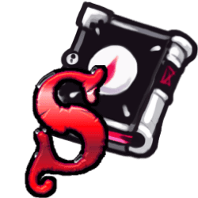

    
    <h2 align="center">Necronomicon's Curse</h2>
    
Cursed by the sentient book!

    <a href="https://discord.gg/cd27aDQDY9">Join the Discord!</a>

-----------------------

# Necronmicon's Curse

After your failure in that one Coven game of yours, the Necronomicon has cursed you with bad memory! Can you save or take over Salem without being able to handle information?

-----------------------

# Is Modding Bannable?

To quote the "Salem Mod Loader" [Discord](https://discord.gg/AdpRqzstfj).
> Use the mod at your own risk, while you have very low odds of being banned, you could be at risk if you openly state in games you are running a modded client as trials may guilty you under hacking even though the mod gives no advantages.

[Town of Salem Rules](https://www.blankmediagames.com/rules/)
> No Cheating – Gaining an unfair advantage over players through means other than normal gameplay. This includes but isn’t limited to using multiple accounts in the same game, sharing information outside the game, using a foreign language to communicate in a way that can’t be understood by the players in the current locale, and posting screenshots to prove something happened in game.

To quote a developer in the official Town of Salem 2 [Discord](https://discord.gg/townofsalem2). [Message Link](https://discord.com/channels/1110363758792036352/1111801081060655154/1112876123852906617)
> We plan to have official mod support, but having a good base is important. A new player won't have a mod preinstalled.
